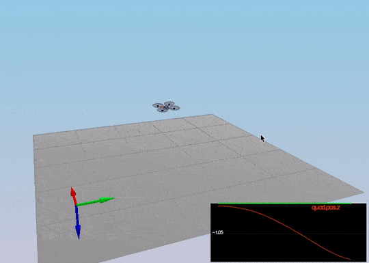
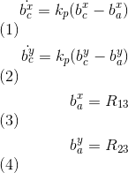
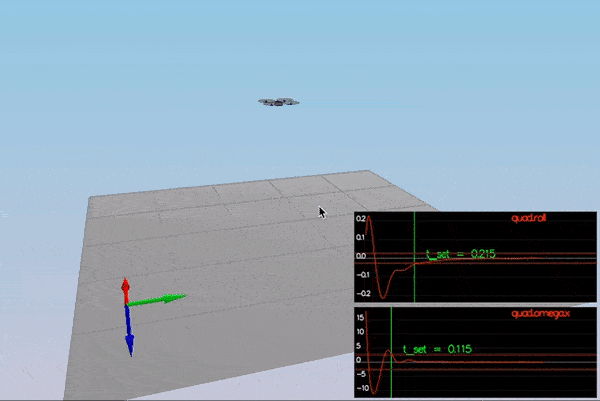
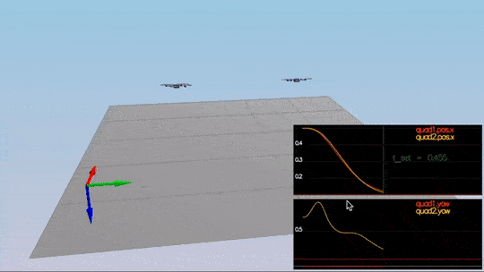
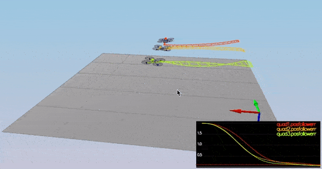
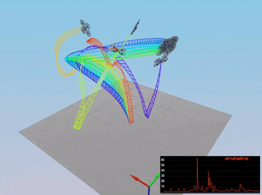
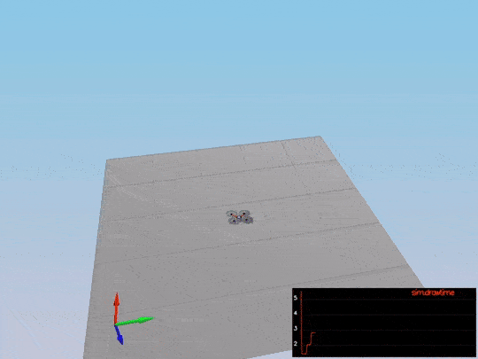

# FCND controls-p3
Udacity Project 3 on Quadcopter controls

In this project, you get to implement and tune a [cascade PID controller](https://controlstation.com/cascade-control-cascade-control-configured/) for drone trajectory tracking. The theory behind the controller design using feed-forward strategy is explained in details on our instructor, [Angela P. Schoellig](http://www.dynsyslab.org/prof-angela-schoellig/), on her paper [Feed-Forward Parameter Identification for Precise Periodic
Quadrocopter Motions](http://www.dynsyslab.org/wp-content/papercite-data/pdf/schoellig-acc12.pdf). The following diagram could be found on that paper describing the cascaded control loops of the trajectory-following controller:


# Project description

There were two parts for this project, where the controller needs to be implemented with python on the first one, and with c++ in the second one. But in later stages the python was removed due to hours requiredto fix the problems.

## C++ implementation

This is the more complicated part of the project. If the parameter tuning on the python part was hard, this part is ten times harder. The C++ part is just a detail on this onerous task. In this case, the simulator is enforced more real limits to the implementation, and things can go wrong when some of those limits are not implemented correctly. More interesting than that is when things are not entirely wrong, just a bit. Udacity also provides a [seed project](https://github.com/udacity/FCND-Controls-CPP) with the simulator implementation and placeholders for the controller code. The seed project README.md give guides to run the project and information of the task we need to execute for implementing the controller. There are five scenarios we need to cover. The simulator runs in a loop on the current scenario and show on the standard output an indication the scenario pass or not.

All the C++ code is here in main directory. The more interesting files are:

- [/config/QuadControlParams.txt](./config/QuadControlParams.txt): This file contains the configuration for the controller. While the simulator is running, you can modify this file, and the simulator will "refresh" those parameters on the next loop execution.
- [/src/QuadControl.cpp](./src/QuadControl.cpp): This is where all the fun is, but I should not say this because this file contains the implementation of the controller only. Most of the time needed to pass the scenarios is spend on the parameter tuning.

### Prerequisites

Nothing extra needs to install. Read this for further deatils regarding installation [Installation](https://github.com/udacity/FCND-Controls-CPP)

### Run the code

Following the instruction on the seed project, load the project on the IDE. Remember the code is on [here](./src).

#### Scenario 1: Intro

In this scenario, we adjust the mass of the drone in [/config/QuadControlParams.txt](./config/QuadControlParams.txt) until it hovers for a bit:



When the scenario is passing the test, you should see this line on the standard output:

```
PASS: ABS(Quad.PosFollowErr) was less than 0.500000 for at least 0.800000 seconds
```

#### Scenario 2: Body rate and roll/pitch control

Now is time to start coding. The [GenerateMotorCommands method](./src/QuadControl.cpp#L58-L93) needs to be coded resolving this equations:


Where all the `F_1` to `F_4` are the motor's thrust, `tao(x,y,z)` are the moments on each direction, `F_t` is the total thrust, kappa is the drag/thrust ratio and `l` is the drone arm length over square root of two. These equations come from the classroom lectures. There are a couple of things to consider. For example, on NED coordinates the `z` axis is inverted that is why the moment on `z` was inverted here. Another observation while implementing this is that `F_3` and `F_4` are switched, e.g. `F_3` in the lectures is `F_4` on the simulator and the same for `F_4`.

The second step is to implement the [BodyRateControl method](./src/QuadControl.cpp#L94-L121) applying a [P controller](https://en.wikipedia.org/wiki/Proportional_control) and the moments of inertia. At this point, the `kpPQR` parameter has to be tuned to stop the drone from flipping, but first, some thrust needs to be commanded in the altitude control because we don't have thrust commanded on the `GenerateMotorCommands` anymore. A good value is `thurst = mass * CONST_GRAVITY`.

Once this is done, we move on to the [RollPitchControl method](./src/QuadControl.cpp#L124-L171). For this implementation, you need to apply a few equations. You need to apply a P controller to the elements `R13` and `R23` of the [rotation matrix](https://en.wikipedia.org/wiki/Rotation_matrix) from body-frame accelerations and world frame accelerations:



But the problem is you need to output roll and pitch rates; so, there is another equation to apply:


It is important to notice you received thrust and thrust it need to be inverted and converted to acceleration before applying the equations. After the implementation is done, start tuning `kpBank` and `kpPQR`(again? yes, and it is not the last time) until the drone flies more or less stable upward:




When the scenario is passing the test, you should see this line on the standard output:

```
PASS: ABS(Quad.Roll) was less than 0.025000 for at least 0.750000 seconds
PASS: ABS(Quad.Omega.X) was less than 2.500000 for at least 0.750000 seconds
```

#### Scenario 3: Position/velocity and yaw angle control

There are three methods to implement here:

- [AltitudeControl](./src/QuadControl.cpp#L173-L219): This is a [PD controller](https://en.wikipedia.org/wiki/PID_controller) to control the acceleration meaning the thrust needed to control the altitude.


To test this, go back to scenario 2 and make sure the drone doesn't fall. In that scenario, the PID is configured not to act, and the thrust should be `mass * CONST_GRAVITY`.

- [LateralPositionControl](./src/QuadControl.cpp#L222-L279) This is another PID controller to control acceleration on `x` and `y`.

- [YawControl](./src/QuadControl.cpp#L282-L316): This is a simpler case because it is P controller. It is better to optimize the yaw to be between `[-pi, pi]`.

Once all the code is implemented, put all the `kpYaw`,`kpPosXY`, `kpVelXY`, `kpPosZ` and `kpVelZ` to zero. Take a deep breath, and start tuning from the altitude controller to the yaw controller. It takes time. Here is a video of the scenario when it passes:



When the scenario is passing the test, you should see this line on the standard output:

```
PASS: ABS(Quad1.Pos.X) was less than 0.100000 for at least 1.250000 seconds
PASS: ABS(Quad2.Pos.X) was less than 0.100000 for at least 1.250000 seconds
PASS: ABS(Quad2.Yaw) was less than 0.100000 for at least 1.000000 seconds
```

#### Scenario 4: Non-idealities and robustness

Everything is coded and tuned already, right? Ok, we need to add an integral part to the altitude controller to move it from PD to PID controller. What happens to me here is that everything starts not working correctly, and I have to tune everything again, starting from scenario -1. Remember patience is a "virtue", and to it again. If you cannot and get frustrated talk to your peers, they will be able to give you hints. It is hard but doable:



When the scenario is passing the test, you should see this line on the standard output:

```
PASS: ABS(Quad1.PosFollowErr) was less than 0.100000 for at least 1.500000 seconds
PASS: ABS(Quad2.PosFollowErr) was less than 0.100000 for at least 1.500000 seconds
PASS: ABS(Quad3.PosFollowErr) was less than 0.100000 for at least 1.500000 seconds
```

#### Scenario 5: Tracking trajectories

This is the final non-optional scenario. The drone needs to follow a trajectory. It will show all the errors in your code and also force you to tune some parameters again. Remember there are comments on the controller methods regarding limits that need to be imposed on the system. Here those limits are required in order to pass.


When the scenario is passing the test, you should see this line on the standard output:

```
PASS: ABS(Quad2.PosFollowErr) was less than 0.250000 for at least 3.000000 seconds
```

There are a few optional scenarios on this project, but I was exhausted. Too many long hours were tuning parameters and finding bugs. There should be a lot of room for improvement. Here is the video of a multi-drone scenario:



No idea why some of them go nuts!!!!! (and then come back to the "formation".)

**Post submit note** The tilt angle limit enforcing was missing on the `RollPitchControl`. Here is a video with no-crazy drones:




# [Project Rubric](https://review.udacity.com/#!/rubrics/1643/view)

## Writeup
### Provide a Writeup / README that includes all the rubric points and how you addressed each one. You can submit your write-up as markdown or pdf.

This markdown is the write-up.

## Implemented Controller

### Implemented body rate control.

The body rate control is implemented as proportional control in [/src/QuadControl::BodyRateControl method ](/src/QuadControl.cpp#L94-L121) from line 94 to 121 using C++.

### Implement roll pitch control.

The roll pitch control is implemented in [/src/QuadControl::RollPitchControl method ](/src/QuadControl.cpp#L124-L171) from line 124 to 171 using C++.

### Implement altitude controller.

The altitude control is implemented in [/src/QuadControl::AltitudeControl method ](/src/QuadControl.cpp#L173-L219) from line 173 to 219 using C++.

### Implement lateral position.

The lateral position control is implemented in [/src/QuadControl::LateralPositionControl method ](/src/QuadControl.cpp#L222-L279) from line 222 to 279 using C++.

### Implement yaw control.

The yaw control is implemented in [/src/QuadControl::YawControl method ](/src/QuadControl.cpp#L282-L316) from line 282 to 316 using C++.

### Implement calculating the motor commands given commanded thrust and moments in C++.

The calculation implementation for the motor commands is in [/src/QuadControl::GenerateMotorCommands method ](/src/QuadControl.cpp#L56-L92) from line 56 to 92.


### Your C++ controller is successfully able to fly the provided test trajectory and visually passes the inspection of the scenarios leading up to the test trajectory.

> Ensure that in each scenario the drone looks stable and performs the required task. Specifically check that the student's controller is able to handle the non-linearities of scenario 4 (all three drones in the scenario should be able to perform the required task with the same control gains used).

The implementation pass scenarios 1 - 5 on the C++ simulator:

```
# Scenario 1
PASS: ABS(Quad.PosFollowErr) was less than 0.500000 for at least 0.800000 seconds
# Scenario 2
PASS: ABS(Quad.Roll) was less than 0.025000 for at least 0.750000 seconds
PASS: ABS(Quad.Omega.X) was less than 2.500000 for at least 0.750000 seconds
# Scenario 3
PASS: ABS(Quad1.Pos.X) was less than 0.100000 for at least 1.250000 seconds
PASS: ABS(Quad2.Pos.X) was less than 0.100000 for at least 1.250000 seconds
PASS: ABS(Quad2.Yaw) was less than 0.100000 for at least 1.000000 seconds
# Scenario 4
PASS: ABS(Quad1.PosFollowErr) was less than 0.100000 for at least 1.500000 seconds
PASS: ABS(Quad2.PosFollowErr) was less than 0.100000 for at least 1.500000 seconds
PASS: ABS(Quad3.PosFollowErr) was less than 0.100000 for at least 1.500000 seconds
# Scenario 5
PASS: ABS(Quad2.PosFollowErr) was less than 0.250000 for at least 3.000000 seconds
```

